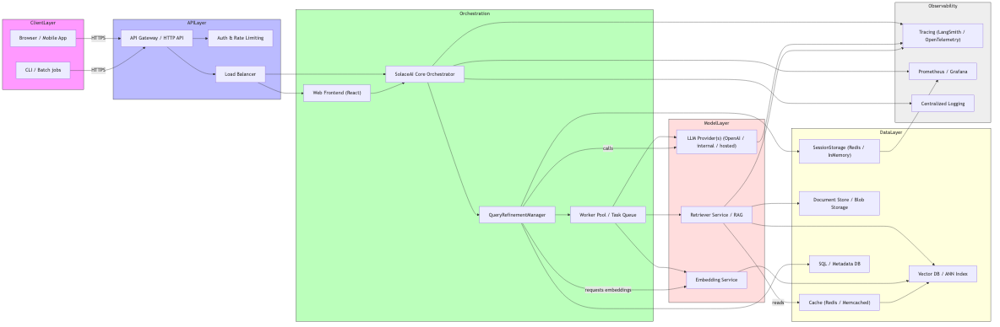
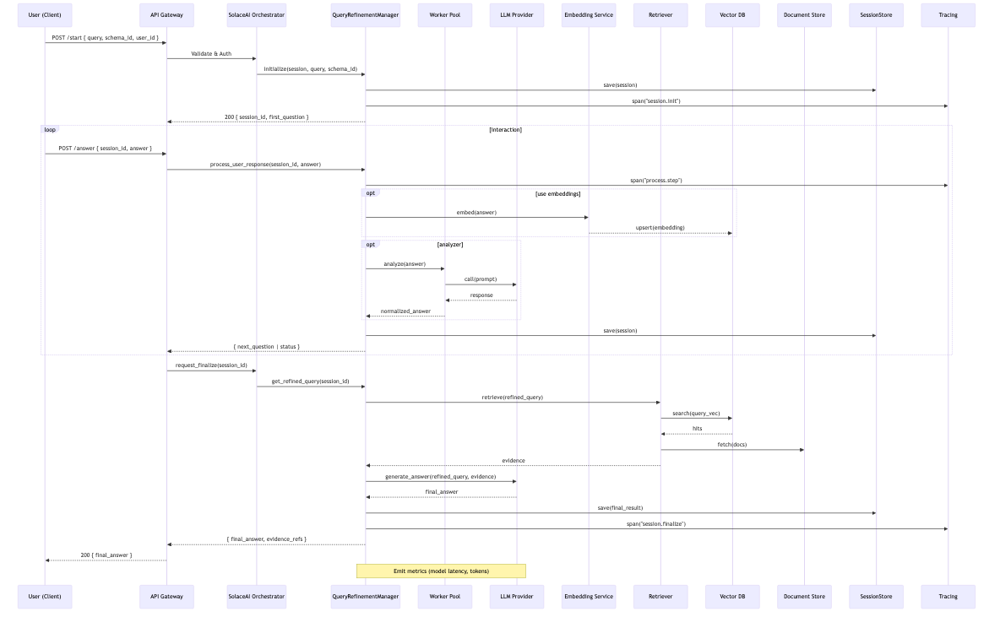

# Solace-AI System Architecture

Generated: 17 October 2025

This document combines the Solace‑AI architecture outline, workflow, and diagrams. Use the attached diagrams for visual reference.

---

## Architecture diagrams

### Component diagram



### Workflow / Sequence diagram



---

## Overview

Solace‑AI is an HTTP/API‑driven platform that orchestrates interactive refinement, retrieval, and answer generation using pluggable LLMs, embeddings, and storage layers. The platform is stateless at the API layer and uses `SessionStorage` (e.g., Redis) and a document/vector store for state and evidence. Observability is integrated via spans, metrics, and structured logs at every major step.


## External API surface (endpoints & minimal contracts)

1. POST /api/v1/sessions/start

Request:

```json
{
  "schema_id": "CLIMATE_HUMANITARIAN_SCHEMA",
  "initial_query": "climate migration in East Africa",
  "user_id": "user-123",
  "metadata": { "source": "web" }
}
```

Response (200):

```json
{
  "session_id": "uuid",
  "status": "in_progress",
  "question": "Which population should we focus on?",
  "step_index": 0
}
```

Errors: 400 SchemaNotFound, 500 StorageError


1. POST /api/v1/sessions/{session_id}/answer

Request:

```json
{ "answer_text": "rural households", "structured": {"age_range":"18-65"} }
```

Response (200):

```json
{ "status": "in_progress", "next_question": "...", "step_index": 1 }
```

Errors: 404 SessionNotFound, 422 ValidationError, 503 ModelUnavailable


1. GET /api/v1/sessions/{session_id}/finalize

Response (200):

```json
{
  "status": "complete",
  "refined_query": "climate migration rural households East Africa last 10 years",
  "final_answer": "Short summary...",
  "evidence_refs": [ { "doc_id": "...", "confidence": 0.92 } ]
}
```

Errors: 409 SessionIncomplete, 500 RetrieverError


1. GET /api/v1/sessions/{session_id}

Response: session JSON


---

## Internal step-by-step flow

### A. Start a session

1. API Gateway authenticates and rate-limits the request.
2. Validate `schema_id` against `RefinementSchema` registry.
3. Create `session` object and persist to `SessionStorage` (Redis recommended).
4. Emit tracing span `session.init` with tags: session_id, schema_id, user_hash.
5. Render first question from schema's first dimension and return `session_id` + question.


### B. User answers

1. Load session from `SessionStorage`.
2. Create tracing span `session.step.process`.
3. Validate answer (required, type checks, sanitize).
4. Optionally call `QueryAnalyzer` or `LLM` to normalize/structure answer.
5. Persist answer and increment step, emit metrics, and return next question or `complete`.


### C. Finalize

1. Load session; start `session.finalize` span.
2. Compose refined query by merging initial query and collected answers.
3. Optionally embed query and call Retriever:
   - Query Vector DB → fetch hits → fetch docs from KnowledgeStore.
4. Call `LLMProvider.generate` with composed prompt + evidence.
5. Post-process, run grounding and safety checks, persist final answer.
6. Emit metrics and return final answer + evidence refs.


---

## Data shapes

`RefinementSession` example:

```json
{
  "session_id":"uuid",
  "schema_id":"CLIMATE_HUMANITARIAN_SCHEMA",
  "user_hash":"sha256(user-id)",
  "initial_query":"climate migration east africa",
  "current_step": 3,
  "answers": [
    { "dimension":"population","answer_text":"rural households","normalized":null,"timestamp":"..." }
  ],
  "final_answer": null,
  "evidence_refs": [],
  "created_at":"..."
}
```


## Observability & tracing

Span names: `session.init`, `session.step.process`, `llm.analyze`, `llm.generate`, `retriever.search`, `session.finalize`.

Metrics examples: `solace_sessions_started_total{schema}`, `solace_llm_latency_seconds{model}`, `solace_retriever_hits`.

Logs: structured JSON, include session_id and error details; redact PII by default.


## Error handling & resiliency

- Storage errors: retry with exponential backoff, return 503 if persistent.
- LLM failures: retry & fallback to smaller model or deterministic template.
- Retriever failure: fallback to text search; return warnings.
- Validation errors: return 422 with actionable message.


## Edge cases to test

- Abandoned sessions & TTL
- Long user inputs (truncate & summarize)
- Schema changes during active sessions (pin to schema version)
- High concurrency and circuit breakers for LLM


## Appendix: diagrams

The high-resolution diagrams are available in this directory:

- `architecture.png` / `architecture.svg`
- `workflow.png` / `workflow.svg`


---

*End of document.*
